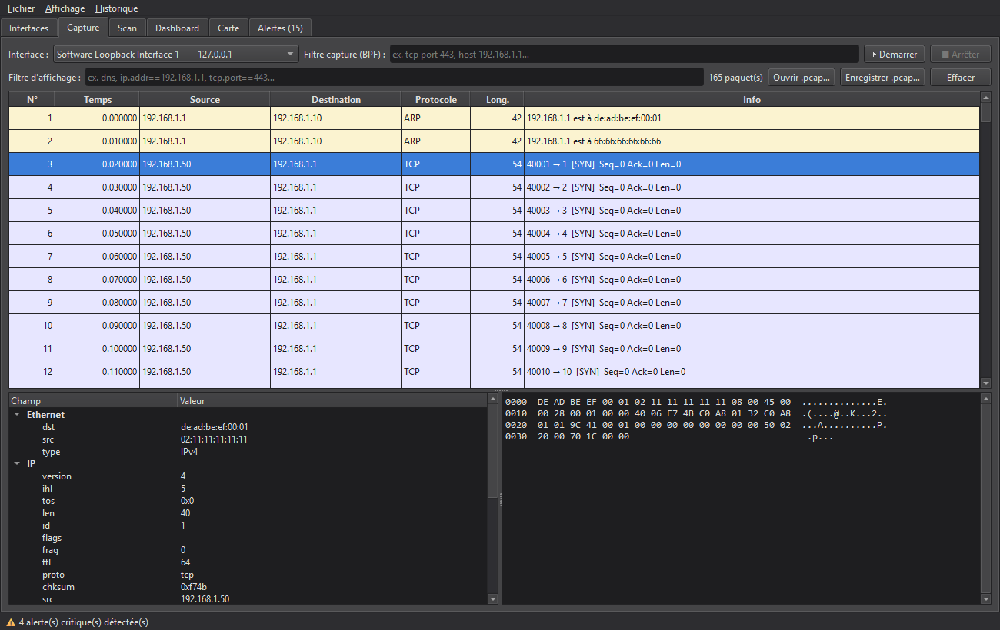
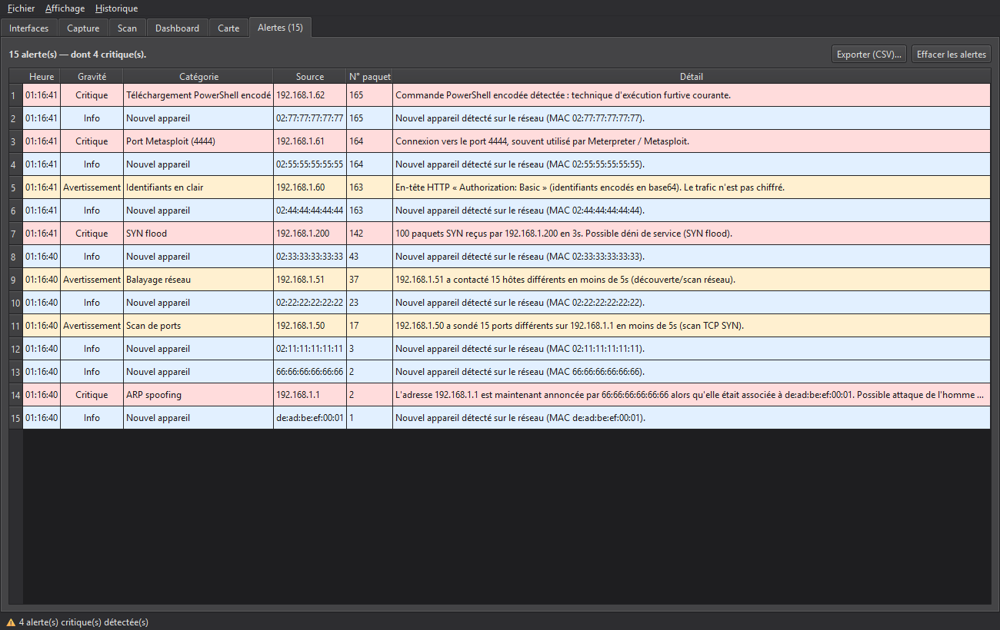

# ArgosNet

[](https://github.com/HiroKenEz/ArgosNet/actions/workflows/tests.yml)


**Analyseur réseau local type Wireshark** — capture et analyse de paquets, scan/cartographie
du réseau, détection de menaces (mini-IDS) et tableau de bord statistique, dans une
application desktop Windows.

> Nommé d'après **Argos Panoptès**, le géant aux cent yeux de la mythologie grecque : le veilleur qui ne dort jamais.

## Aperçu



*Capture et analyse de paquets (thème sombre) : liste colorée par protocole, décodage
multi-couches et vue hexadécimale synchronisée.*



*Le mini-IDS en action : alertes classées par gravité — ARP spoofing, scan de ports,
balayage réseau, SYN flood, identifiants en clair, signatures YAML.*

---

## ⚠️ Cadre légal et éthique

ArgosNet est un outil **éducatif et défensif**. Il ne doit être utilisé que :

- sur un réseau que **vous possédez**, ou
- sur un réseau pour lequel vous disposez d'une **autorisation écrite explicite**.

Le sniffing de paquets et le scan de ports sur un réseau tiers sans autorisation sont
**illégaux** dans la plupart des pays. L'utilisateur est seul responsable de son usage.

---

## Prérequis (Windows 11)

1. **Python 3.11+** (64 bits).
2. **Npcap** — pilote de capture. À installer depuis [npcap.com](https://npcap.com) en
   cochant l'option **« Install Npcap in WinPcap API-compatible Mode »**.
3. Lancer l'application **en tant qu'administrateur** : la capture brute et le scan de
   ports nécessitent des privilèges élevés sous Windows.

## Installation

```powershell
# Créer et activer un environnement virtuel
python -m venv .venv
.\.venv\Scripts\Activate.ps1

# Installer les dépendances
pip install -r requirements.txt
```

## Lancement

```powershell
python -m argosnet.main
```

Au démarrage, ArgosNet vérifie la présence de Npcap et les privilèges administrateur, et
affiche un avertissement le cas échéant.

## Démo rapide (sans Npcap)

Pas besoin de Npcap pour explorer toute l'interface : ouvrez une capture existante.

1. Lancez l'application.
2. **Fichier → Ouvrir une capture .pcap…**
3. Choisissez un des fichiers d'exemple fournis :
   - `tests/sample.pcap` — trafic normal (TCP, DNS, ARP, ICMP, IPv6) ;
   - `tests/attack_sample.pcap` — trafic malveillant : l'onglet **Alertes** se remplit
     (ARP spoofing, scan de ports, balayage, SYN flood, identifiants en clair, signatures).

Le **Dashboard** se remplit automatiquement, et les alertes peuvent être exportées en CSV.

---

## Fonctionnalités

| Pilier | Description |
|--------|-------------|
| **Scan réseau** | Découverte ARP des hôtes, scan de ports, résolution constructeur/nom |
| **Capture & analyse** | Sniffing live, décodage multi-couches, filtres, export/import `.pcap`, **capture en anneau** (fichiers rotatifs pour monitoring continu) |
| **Détection de menaces** | ARP spoofing, scans/balayages, SYN flood, nouvel appareil, identifiants en clair, **tunneling DNS**, **beaconing C2**, **serveur DHCP rogue**, **port knocking**, **threat intel** (liste noire d'IP + **empreintes JA3**), et mini-IDS à règles YAML éditables |
| **Statistiques** | Débit temps réel, **IO Graph par protocole**, répartition par protocole, top talkers |
| **Carte réseau** | Graphe nœud-lien des hôtes et de leurs échanges (local vs externe) |
| **Conversations** | Paires d'hôtes triées par volume |
| **Inventaire** | Appareils connus (MAC / IP / constructeur / vu le), **libellés personnalisés** |
| **Follow Stream** | Réassemblage d'un flux TCP (clic droit sur un paquet) |
| **Historique** | Persistance SQLite des alertes et des appareils connus, export CSV |
| **Thème** | Interface claire ou sombre (menu **Affichage**), sombre par défaut |

Décodeurs : Ethernet/ARP, IPv4/IPv6, TCP/UDP/ICMP, **DNS/mDNS**, **DHCP**, **HTTP**
(méthode/URL/host) et **TLS** (extraction du SNI et **empreinte JA3**).

L'historique est stocké dans `~/.argosnet/argosnet.sqlite` : les alertes survivent aux
redémarrages, et un appareil déjà connu ne redéclenche pas d'alerte « nouvel appareil ».
Le menu **Historique** permet d'effacer les alertes ou d'oublier les appareils.

## Architecture

Voir la structure du dépôt : le paquet `argosnet/` sépare le cœur (`core/`) de l'interface
(`ui/`). La capture et les scans s'exécutent dans des threads de fond pour ne jamais geler
la GUI ; le flux de paquets est distribué à la liste, au moteur de statistiques et au moteur
de détection via le mécanisme signals/slots de Qt.

## Tests

La logique cœur (dissection, filtres, détection, statistiques) est couverte par une suite
`pytest` qui tourne **hors-ligne**, sans Npcap :

```powershell
pip install -r requirements-dev.txt
python -m pytest tests/
```

Les captures d'exemple sont régénérables depuis les fixtures :

```powershell
python tests/generate_pcaps.py
```

## Packaging (exécutable autonome)

```powershell
pip install -r requirements-dev.txt
pyinstaller argosnet.spec
```

Produit `dist/ArgosNet.exe` (~65 Mo), un exécutable Windows autonome. Vérification à froid :

```powershell
.\dist\ArgosNet.exe --selftest
```

## Personnaliser la détection

Les signatures du mini-IDS sont éditables dans
[`argosnet/core/detection/rules.yaml`](argosnet/core/detection/rules.yaml) : chaque règle
combine un `dst_port` et/ou une sous-chaîne `contains`, avec un niveau de gravité. Ajoutez
vos règles sans toucher au code.
